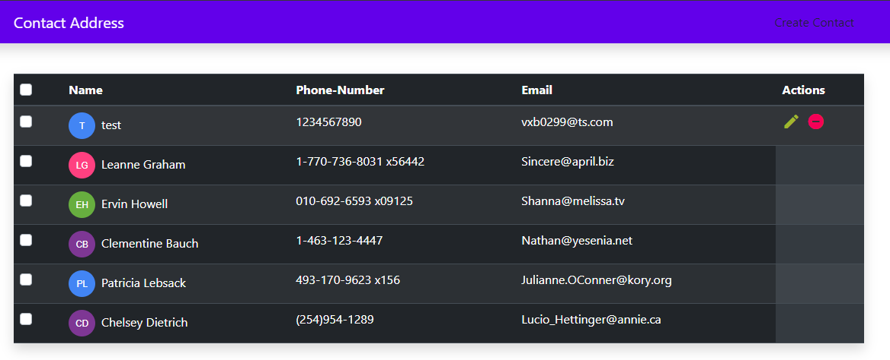
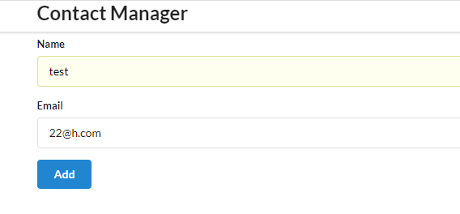
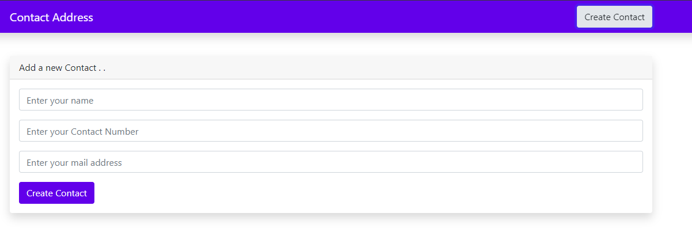
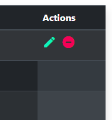

# React - Redux
I've made 2 web app with help of React - Redux. Just for my own learning purposes. 

After npm-start ---> Visit : http://localhost:3000/


Please, refer below screenshots for better understanding.
## Screenshots

#### Here are Screenshots of above web-app




#### Create Contact


#### Edit - Delete Actions 



## Installation

Install project with npm

```bash
  npm install react-scripts
  npm start 
```
    
